import QuizProgress from '@site/src/components/QuizProgress';
import QuizForm from '@site/src/components/QuizForm';
import {CourseId, Lesson_1} from "@site/src/constants/course";

<QuizProgress courseId={CourseId} lessonId={Lesson_1}></QuizProgress>

# WTF Starknet 1. L'Account Abstraction

Que se passerait-il s'il vous arrivait de perdre l'accès aux clés privées de votre portefeuille ?

Rien de bon, n'est-ce pas ?

Et cela parce que votre clé privée est votre compte. Perdre votre clé signifie perdre votre compte, votre argent, vos données: Tout !

Avec l'Account Abstraction (AA), si un utilisateur perd ses accès par erreur, il est possible l'aider à récupérer ses informations, car chaque compte est un smart-contrat (ou contrat intelligent) qui contient une logique et mettre en œuvre un flux.

Aussi, utiliser une logique de smart-contrat pour spécifier non seulement les effets de la transaction, mais également la logique de paiement et de validation des frais, offre de nombreux avantages de sécurité importants, tels que les portefeuilles de récupération multisignatures et intelligents, la possibilité de changer de clé sans changer de portefeuille et la sécurité quantique.
et bien plus encore.

## 1. Comment les comptes fonctionnent-ils aujourd'hui

**Ethereum utilise deux types de "comptes" différents :**

* Les Comptes de contrats
* Les Externally Owned Account (EOA) ou comptes détenus en externe (EOA)

*Les EOA sont des comptes d'utilisateurs traditionnels.*

S'Il existe [des différences clés](https://ethereum.org/en/developers/docs/accounts/) entre les EOA et les contrats,

**Les deux types de compte ont cependant la capacité de :**

* Recevoir, conserver et envoyer des ETH et des tokens
* Interagir avec des contrats intelligents déjà déployés

## 2. Les Comptes de l'AA (Account Abstraction)

L'Account Abstraction unifie les notions de comptes contractuels et les EOA.

Cela rend les comptes d'utilisateurs plus "programmables". Vous supprimez la logique de signature des transactions du compte, vous la rendez "abstraite", d'où l'abstraction du compte.

Les nouvelles expériences qui s'offrent maintenant à vous, proviennent plus des fonctionnalités rendues possibles par l'abstraction de comptes que de l'abstraction elle-même.

Il ne s'agit plus maintenant d'avoir ununique pour tous les cas d'usage, mais maintenant chaque utilisateur peut avoir un compte adapté à ses besoins.

* Vous souhaitez utiliser un schéma de signature autre que ECDSA ? créez un compte pour le faire !
* Vous souhaitez utiliser plusieurs clés pour autoriser les transactions ? Créez un compte pour le faire !
* Vous souhaitez changer le signataire de votre compte chaque semaine ? Vous pouvez également créer un compte pour le faire !

On peut Ainsi dire, que l'Account Abstraction vous offre une "validité de transaction programmable".

## 3. Starknet et l'Account Abstraction

Starknet se concentre sur certains composants clés du protocole :

1. L'abstraction de signature:
    * Permet différents contrats de compte à utiliser différents schémas de validation de signature.
2. L'abstraction de paiement:
    * Permet différents modèles de paiement pour les transactions. Par exemple, paiement par une autre partie ou contrat.
    * Meilleure experience utilisateur : n'impose pas l'utilisation d'un jeton spécifique (natif ou défini par contrat) pour payer les transactions.
    
    Vous pouvez lire l'intégralité de la proposition [ici](https://community.starknet.io/t/starknet-account-abstraction-model-part-1/781). Qui est une version améliorée du modèle présenté dans l'[ERC-4337](https://medium.com/infinitism/erc-4337-account-abstraction-without-ethereum-protocol-changes-d75c9d94dc4a) d'Ethereum.
    
## 4. Quels portefeuilles prennent en charge les AA ?

Si nous nous concentrions sur les portefeuilles qui implémentent l'AA, nous avons deux options principales que nous détaillons ci-dessous:

### 4.1 Argent

Argent X est le portefeuille le plus populaire et le seul disponible actuellement en  open source sur Starknet, vous pouvez acheter et "bridger" des cryptomonnaies sur Starknet, échanger des tokens, créer et stocker des NFT, jouer à des jeux web3 et bien plus encore.

#### Comment créer un wallet Argent X

1.  Accédez à la boutique en ligne de votre navigateur, téléchargez et ajoutez l'extension Argent X.

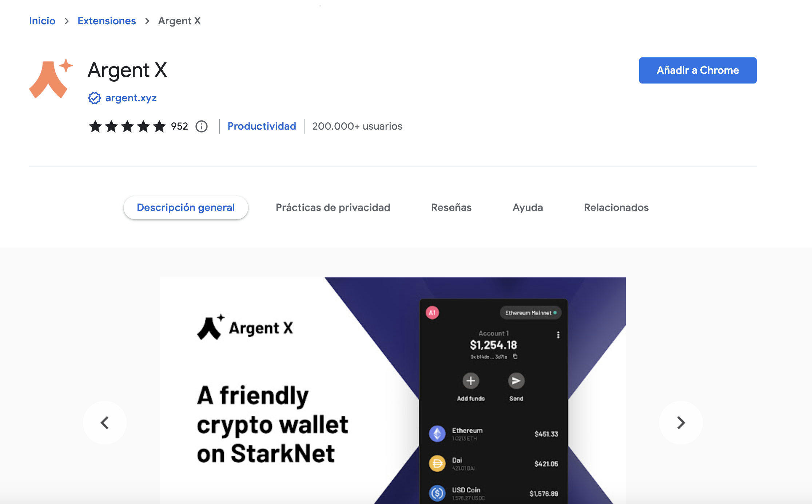

2. Clickez sur "créer un nouveau wallet"

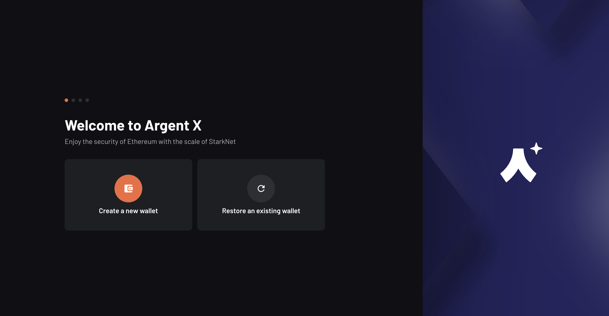

3. Lisez les Conditions d'Utilisation et clickez sur "continuer"

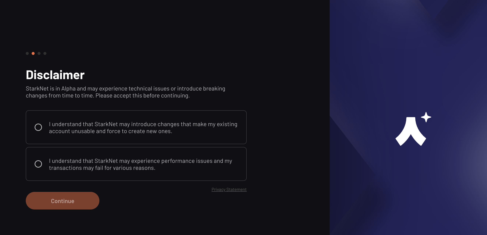

4. Associez un mot de passe à votre wallet
 
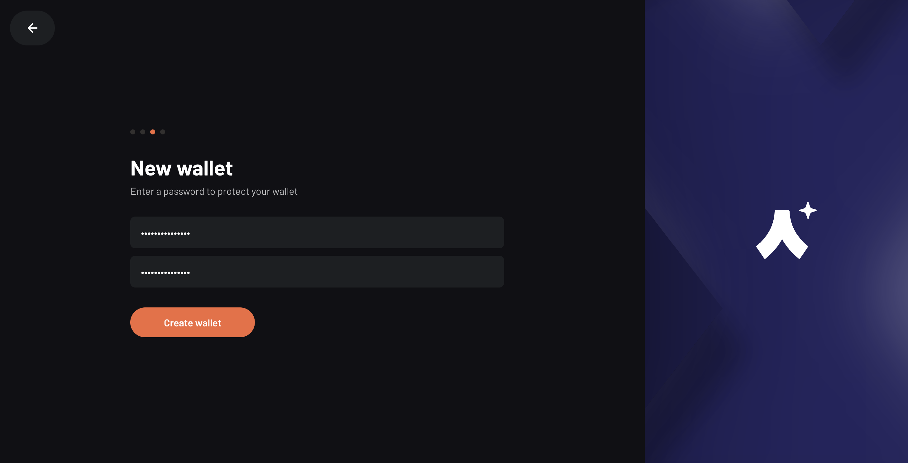

5. Votre wallet est enfin pret ! Clickez sur "finish" et, si vous le souhaitez, accrochez l'extension Argent X à votre navigateur pour un accès rapide.

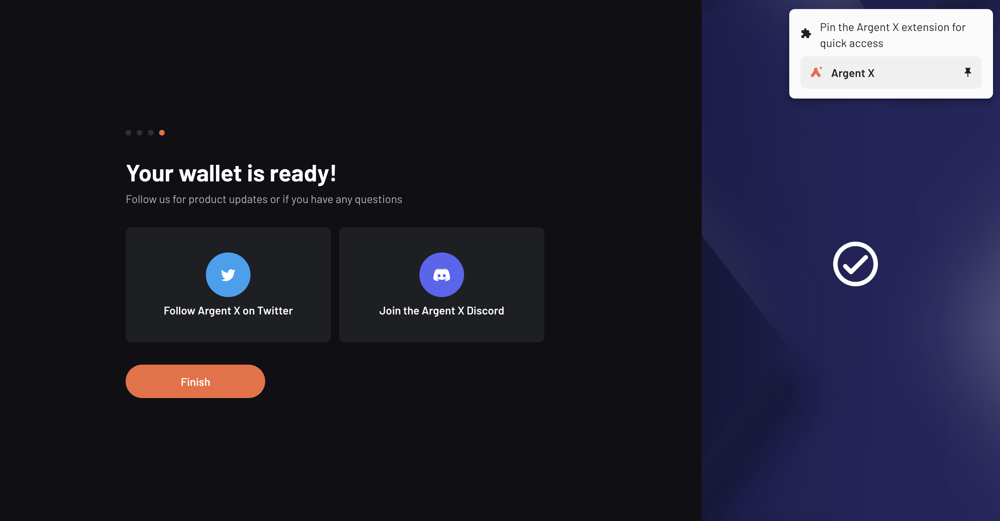

6. Clickez sur l'extension pour ouvrir votre wallet

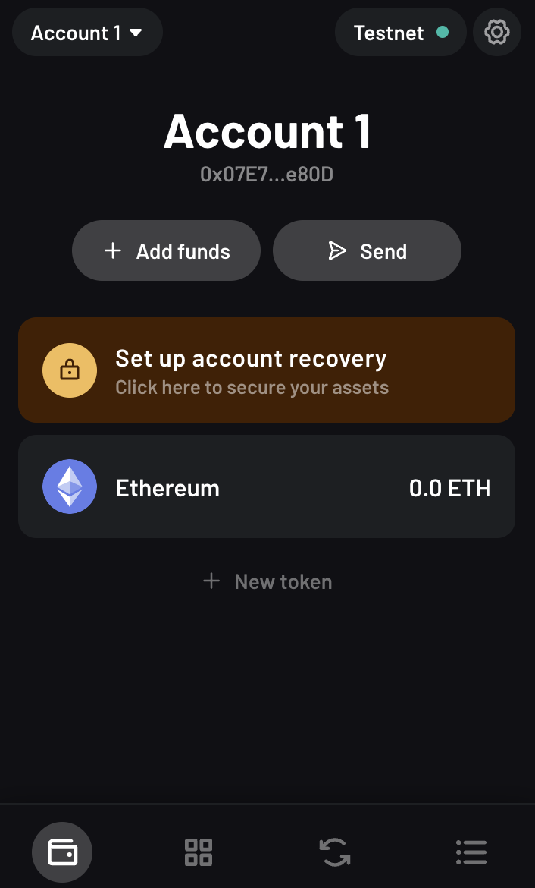

#### Pour Votre information

*Toute transaction effectuée sur la blockchain utilise du gas, il s'agit d'une petite quantité de crypto. Avant d'effectuer de commencer à explorer Starknet mainnet (le réseau principale), vous aurez besoin de fonds pour déployer votre wallet Argent X, comme chaque wallet est un smart contract sur Starknet (une classe  d'AA) et requiere une petite transaction on-chain pour s'activer.*

Une fois cela effectué, vous aurez la possibiliter d'envoyer, échanger et ajouter des tokens.

#### Les fonctionnalités d'Argent X

Le wallet Argent X possède toutes les fonctionnalités d'un portefeuille crypto traditionnel, mais comme il est un smart contrat sur la Starknet, il possède des propriétés uniques:

* Surveillance de la fraude.
* Revue des transactions
* Traitement de transactions par batch.
* Récupération sociale.
* Clef de session.

maintenant que vous savez, explorons ! 

### 4.2 Braavos

Braavos n'est pas seulement une application de navigateur mais une application mobile native, vous pouvez donc stocker vos tokens, transférer, échanger et gérer vos objets de collection NFT, mais plus encore, accéder et vous connecter à n'importe quel dApp sur Starknet depuis votre téléphone.

Votre mobile est toujours avec vous, vous permettant d'accéder à vos cryptos quand et où vous le souhaitez avec la confidentialité de votre cryptage biométrique.

#### Comment Creer un wallet Braavos

1.  Accédez à la boutique en ligne de votre navigateur, téléchargez et ajoutez l'extension Braavos.

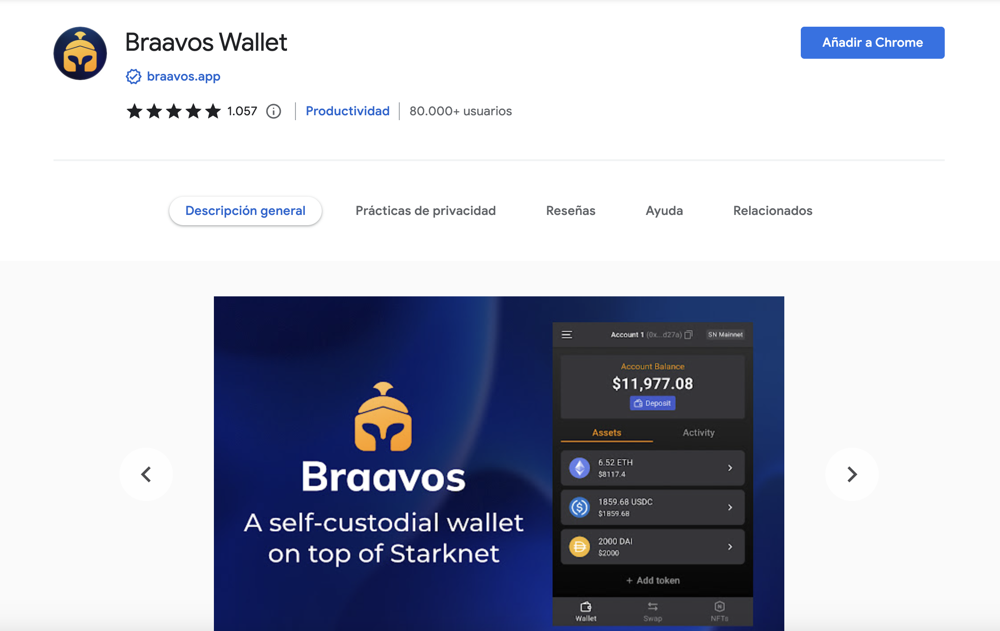

2. Accroché l'extension Braavos à votre navigateur, pour un accès rapide, et appuyez sur "Get Started"

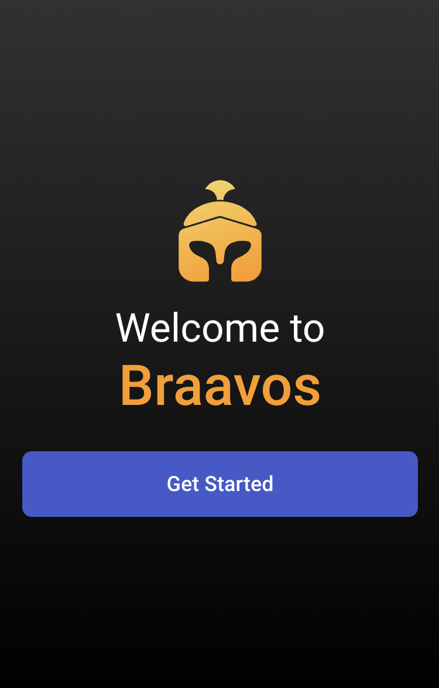

3. Associez un mot de passe à votre wallet
 
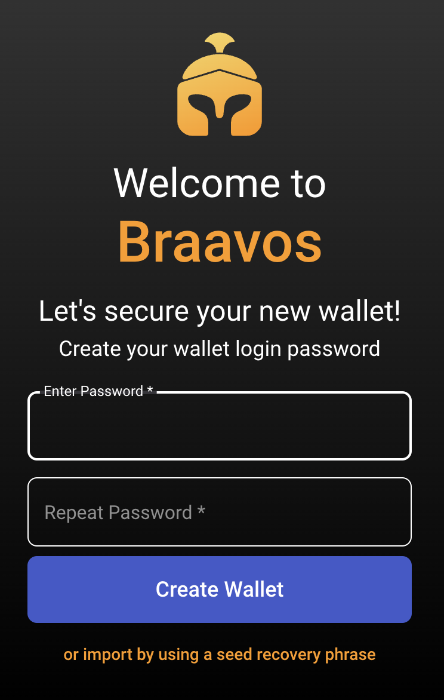

4. Enregistrez votre phrase de récupération secrète.

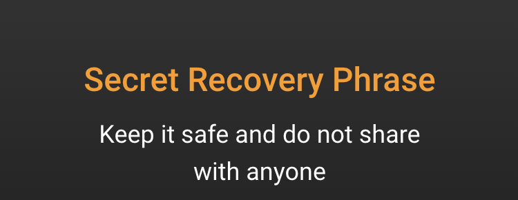

5. Vous êtes maintenant prets à utiliser votre portefeuille

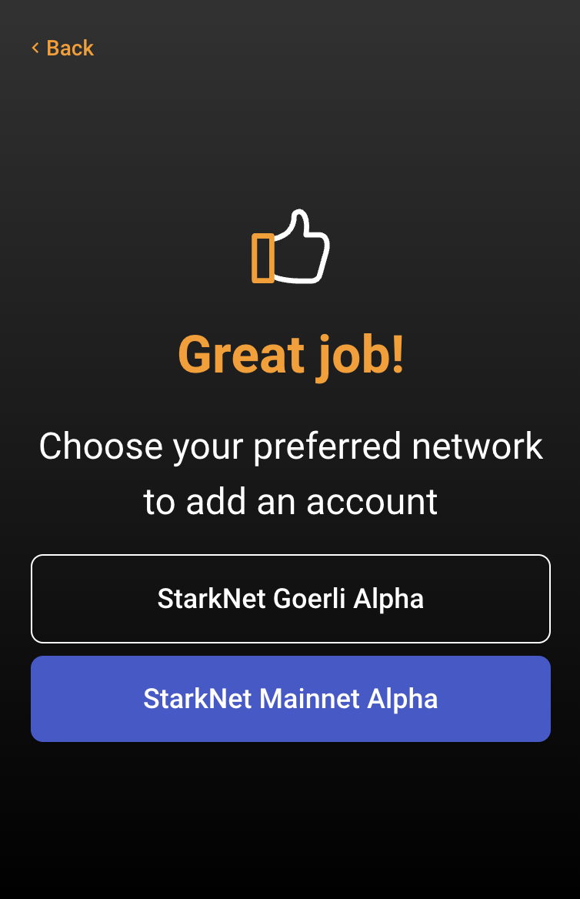

6. N'oubliez pas que vous devez déposer des jetons dans votre portefeuille si vous souhaitez utiliser le réseau principal, afin d'activer le compte de contrat intelligent.

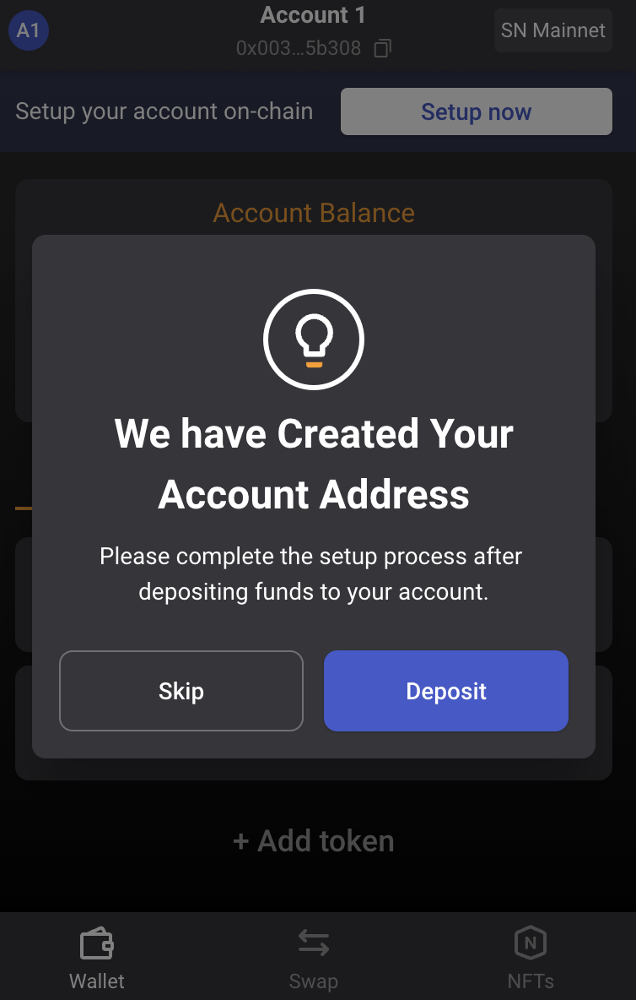

## 5. Résumé

Dans ce tutoriel, nous avons introduit l'Account Abstraction et comment créer un compte Argent/Braavos.

<QuizForm link={"https://docs.google.com/forms/d/e/1FAIpQLScrzgrJ9sPCuGm4HYRCyLqnur9xp2B9rqGGzBp4suGUVZyOww/viewform?usp=sf_link"}></QuizForm>
